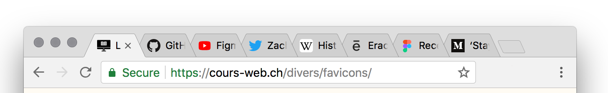

Informations sur les favicons, et la manière de les intégrer dans une page web.

Une favicon (contraction de "favorite icon") est une icône graphique symbolisant un site web. Les navigateurs web peuvent utiliser la favicon dans la barre d'adresse, les signets, ou dans les raccourcis.



La fonctionnalité a été introduite par le navigateur Internet Explorer, qui testait la présence d'un fichier `favicon.ico` à la racine du site. Sans avoir été standardisé, ce concept a été adopté par l'ensemble des navigateurs graphiques. 

Le méthode la plus simple consiste à charger l'icône dans l'en-tête `<head>`, avec un code de ce type:

```html
<link rel="icon" type="image/png" href="favicon.png" />
```

Cette icône avait initialement une taille de 16 × 16 ou 32 × 32 pixels.

### Complications avec les appareils mobiles

L'arrivée d'appareils à écrans Retina – Apple iPhone suivi de Android – a conduit à des formats d'images plus grandes, pouvant être utilisées comme icônes dans ces applications, sur l'écran de démarrage d'un appareil.

Voici un exemple de site servant différents formats (il s'agit du site du *New York Times*, en novembre 2017):

```html
<link rel="shortcut icon" href="https://static01.nyt.com/favicon.ico" />
<link rel="apple-touch-icon-precomposed" sizes="144×144" href="https://static01.nyt.com/images/icons/ios-ipad-144x144.png" />
<link rel="apple-touch-icon-precomposed" sizes="114×114" href="https://static01.nyt.com/images/icons/ios-iphone-114x144.png" />
<link rel="apple-touch-icon-precomposed" href="https://static01.nyt.com/images/icons/ios-default-homescreen-57x57.png" />
```

Nous avons donc: 

* un format ICO (48x48px).
* un PNG de 57 px.
* un PNG de 114 px (format utilisé par le iPhone 4+).
* un PNG de 144 px (iPad 3+).

On peut aller encore plus loin, voici le code produit par le site [favicon-generator.org](https://www.favicon-generator.org/) :

```html
<link rel="apple-touch-icon" sizes="57x57" href="/apple-icon-57x57.png">
<link rel="apple-touch-icon" sizes="60x60" href="/apple-icon-60x60.png">
<link rel="apple-touch-icon" sizes="72x72" href="/apple-icon-72x72.png">
<link rel="apple-touch-icon" sizes="76x76" href="/apple-icon-76x76.png">
<link rel="apple-touch-icon" sizes="114x114" href="/apple-icon-114x114.png">
<link rel="apple-touch-icon" sizes="120x120" href="/apple-icon-120x120.png">
<link rel="apple-touch-icon" sizes="144x144" href="/apple-icon-144x144.png">
<link rel="apple-touch-icon" sizes="152x152" href="/apple-icon-152x152.png">
<link rel="apple-touch-icon" sizes="180x180" href="/apple-icon-180x180.png">
<link rel="icon" type="image/png" sizes="192x192"  href="/android-icon-192x192.png">
<link rel="icon" type="image/png" sizes="32x32" href="/favicon-32x32.png">
<link rel="icon" type="image/png" sizes="96x96" href="/favicon-96x96.png">
<link rel="icon" type="image/png" sizes="16x16" href="/favicon-16x16.png">
<link rel="manifest" href="/manifest.json">
<meta name="msapplication-TileColor" content="#ffffff">
<meta name="msapplication-TileImage" content="/ms-icon-144x144.png">
<meta name="theme-color" content="#ffffff">
```

### Retour à la simplicité

Voici [une longue discussion](https://github.com/h5bp/html5-boilerplate/issues/1367) sur le sujet des favicons, dans le projet HTML5Boilerplate.

La méthode finalement retenue par le HTML5Boilerplate est relativement simple:

```html
<link rel="apple-touch-icon" href="icon.png">
<!-- Place favicon.ico in the root directory -->
```

On propose donc deux formats:

* Un fichier ICO (favicon.ico) de 32x32 px.
* Un fichier PNG (apple-touch-icon) mesurant 192x192 pixels.

