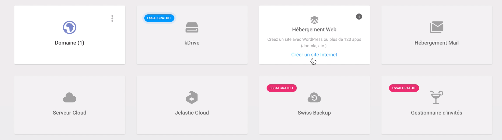
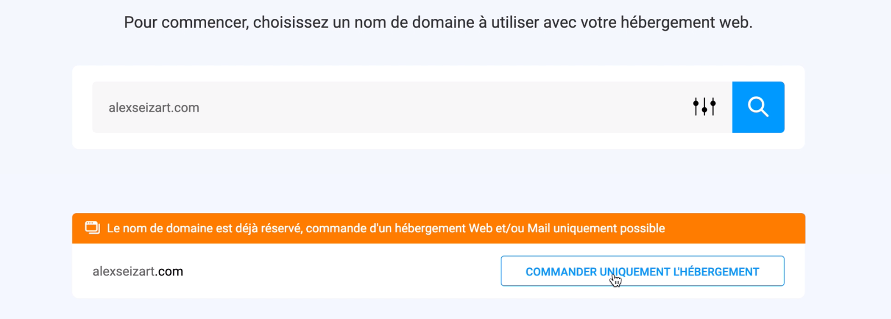
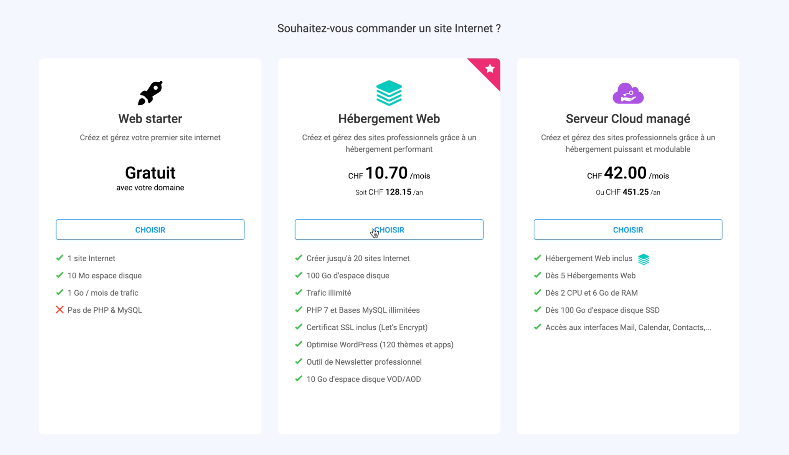
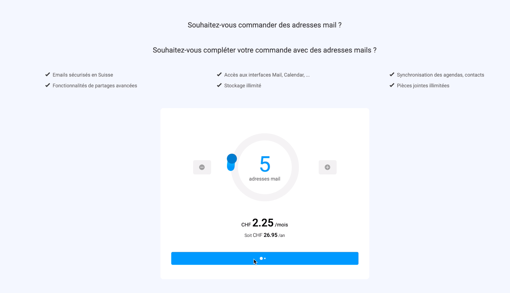
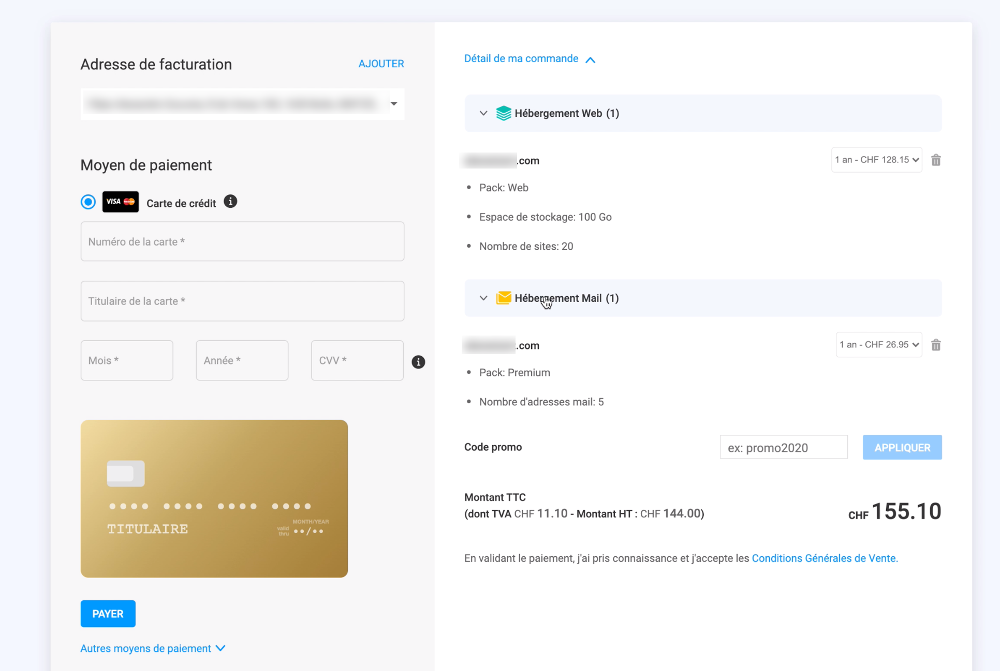

# Hébergement pour étudiant·es 

Si vous êtes en formation, il est possible d'obtenir un hébergement web à tarif réduit (voire gratuit). Voici quelques exemples: 

- **Cargo**, plateforme pour sites-portfolio: propose un [Student Program](https://cargo.site/Students).
- **Infomaniak** propose une offre d'hébergement Web + Mail gratuite pour étudiant·s ([lire toutes les informations](https://www.infomaniak.com/fr/support/faq/2229/infomaniak-pour-les-etudiants-conditions-dadmission)). Le nom de domaine n'est pas inclus, il restera à votre charge.

## Procédure pour Infomaniak

1. Vous devez avoir [créé un compte Infomaniak](https://www.infomaniak.com/) et avoir acheté un nom de domaine.
2. Scannez ou photographiez votre carte d'étudiant·e et carte d'identité.
3. Envoyez les scans [au support d'Infomaniak](https://support.infomaniak.com/). Indiquez que vous souhaitez activer l'hébergement gratuit pour étudiants.
4. Une fois la confirmation obtenue, commandez votre hébergement. Choisir l'offre standard "Hébergement Web", et pas l'offre "Web starter".

Voici à quoi ressembleront ces étapes:

Quand vous aurez saisi les deux codes promo (web et email), le prix du produit sera de zéro CHF, et vous pourrez confirmer la commande.